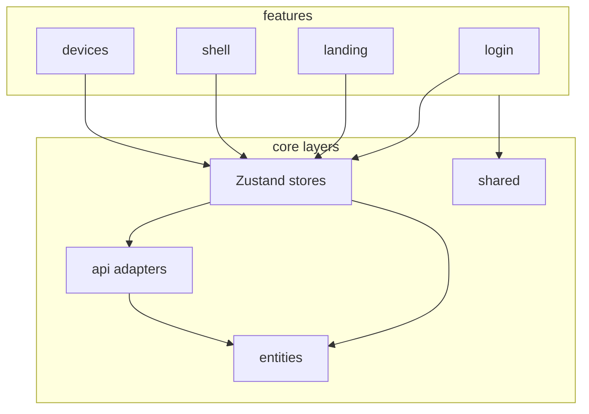
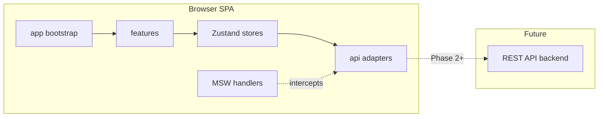
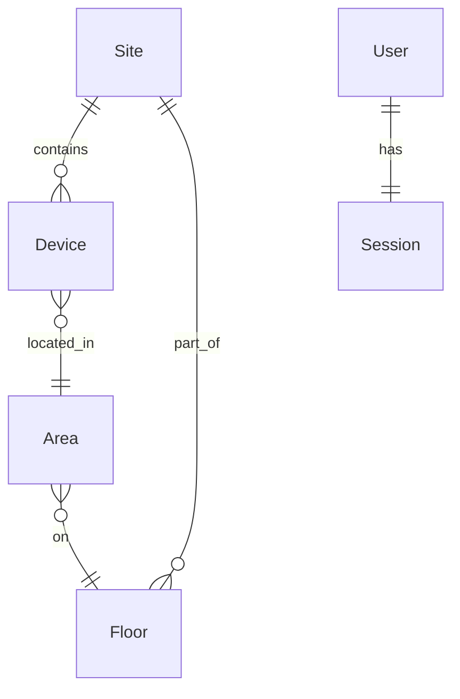

# Architecture Spine — Fleet 360

## Design Paradigm

**Feature-sliced SPA** — vertical ownership by user-facing capability. Each feature slice owns its UI, local hooks, and slice-specific components. Cross-cutting types live in `entities/`; REST access in `api/`; reusable UI and tokens in `shared/`. The app shell (`features/shell`) wraps all authenticated routes.



**Dependency rule:** `features/` → `stores/` → `api/` → `entities/`. Features may import `shared/` and `entities/` types only — never `api/` directly, never another feature's internals.

## Invariants & Rules

### AD-1 — Feature-sliced ownership [ADOPTED]

- **Binds:** all Phase 1 features (Login, Landing, Shell, Devices)
- **Prevents:** two builders placing the same capability in different folders or importing across feature boundaries
- **Rule:** Each PRD feature area maps to one `src/features/<name>/` slice. Slices do not import from sibling slices; shared behavior moves to `shared/` or `entities/`.

### AD-2 — Zustand owns all state [ADOPTED]

- **Binds:** `useAuthStore`, `useDeviceStore`, `useShellStore`, all server-fetched data
- **Prevents:** split-brain between a UI state library and a separate server-cache library; fetch logic in components
- **Rule:** All mutable application state lives in domain Zustand stores. Stores encapsulate fetch, polling, loading, error, and entity cache. Components read stores; they do not hold server data in local state.

### AD-3 — API adapter boundary

- **Binds:** `src/api/`, all REST interactions
- **Prevents:** scattered `fetch` calls, inconsistent DTO handling, mock logic in feature code
- **Rule:** Only `api/` modules call `fetch`. Each resource exposes typed functions (`authApi.login`, `devicesApi.list`). Adapters map DTOs to `entities/` types before returning. Features and stores never import `fetch`.

### AD-4 — Mock via MSW behind same URLs [ADOPTED]

- **Binds:** Phase 1 data layer, `src/mocks/`
- **Prevents:** feature-specific fixtures, incompatible shapes when real API arrives
- **Rule:** MSW handlers intercept the same URL paths `api/` adapters call. Swapping to production removes MSW (or sets `VITE_USE_MSW=false`); feature and store code unchanged.

### AD-5 — Session in localStorage + route guards [ADOPTED]

- **Binds:** FR-1, NFR-2, NFR-6, `useAuthStore`, React Router
- **Prevents:** inconsistent auth checks, session lost on refresh, unguarded protected pages
- **Rule:** Token persisted under `localStorage` key `fleet360:session`. `useAuthStore` hydrates on app boot. `<ProtectedRoute>` reads auth store; unauthenticated access to protected paths redirects to `/login`. Logout clears store and storage.

### AD-6 — Canonical entity types

- **Binds:** Device list, Device detail tabs, upload, filters
- **Prevents:** list row shape diverging from detail tab shape; duplicate type definitions
- **Rule:** Shared domain types (`Device`, `Site`, `Session`, `User`, `DeviceFilter`) defined once in `src/entities/`. Stores hold entities, never raw API DTOs. Adapters perform DTO→entity mapping.

### AD-7 — Design tokens as CSS variables [ADOPTED]

- **Binds:** all UI features, NFR-3 contrast requirements
- **Prevents:** hardcoded colors/spacing diverging from approved UX design
- **Rule:** `DESIGN.md` tokens exported to `shared/styles/tokens.css` as CSS custom properties. Feature styles reference `var(--color-*)`, `var(--spacing-*)` — no literal hex or px for tokenized values in feature code.

### AD-8 — Device polling in store

- **Binds:** FR-16, NFR-1, `useDeviceStore`
- **Prevents:** duplicate polling intervals, list and detail fetching independently
- **Rule:** `useDeviceStore` owns a 30-second poll via `setInterval` calling `devicesApi.list`. Poll starts when Devices route mounts; stops on unmount. List and detail read from the same store cache.

### AD-9 — Error envelope

- **Binds:** NFR-5, all stores and API adapters
- **Prevents:** raw stack traces or inconsistent error messages in UI
- **Rule:** `api/` throws `ApiError { code, message, status }`. Stores catch and expose a user-facing `error: string | null`. UI renders store error strings only — never raw exception objects.

### AD-10 — Static SPA on Vercel

- **Binds:** deployment, environments
- **Prevents:** environment-specific URLs hardcoded in source
- **Rule:** Vite builds a static SPA deployed to Vercel. Config via env: `VITE_API_BASE_URL`, `VITE_USE_MSW`. No server-side rendering in Phase 1.

## Consistency Conventions

| Concern | Convention |
| --- | --- |
| Naming (entities, files, interfaces) | PascalCase types (`Device`); camelCase functions; kebab-case CSS files; feature folders lowercase (`devices/`) |
| Data & formats | ISO 8601 dates in entities; API errors as `ApiError`; device IDs are opaque strings |
| State & cross-cutting | One Zustand store per domain; auth token key `fleet360:session`; polling interval 30 000 ms |
| Routing | React Router v7; public `/login`; protected `/`, `/devices`, `/devices/:deviceId/:tab?`; stubs at `/sites`, `/users` |
| Auth | Email + password; mock accepts any valid-format credentials in Phase 1 |

## Stack

| Name | Version |
| --- | --- |
| React | 19.2.8 |
| TypeScript | 6.0.2 |
| Vite | 8.2.2 |
| Zustand | 5.0.15 |
| React Router | 8.4.0 |
| MSW | 2.15.0 |

## Structural Seed





```text
src/
  app/                  # bootstrap, router, MSW init, providers
  features/
    login/              # FR-1..FR-5
    landing/            # FR-6..FR-8
    shell/              # FR-9..FR-11 — header, nav, site selector
    devices/
      upload/           # FR-12..FR-15
      list/             # FR-16..FR-19
      detail/           # FR-20..FR-27
  entities/             # Device, Site, Session, User, DeviceFilter
  api/                  # authApi, devicesApi, uploadApi + DTO mappers
  shared/
    ui/                 # Button, Badge, FilterChip, TabBar
    styles/             # tokens.css, globals
    lib/                # ApiError, formatters
  stores/               # useAuthStore, useDeviceStore, useShellStore
  mocks/                # MSW handlers, fixture data
```

## Capability → Architecture Map

| Capability / Area | Lives in | Governed by |
| --- | --- | --- |
| Authentication (FR-1..FR-5) | `features/login`, `stores/useAuthStore`, `api/authApi` | AD-2, AD-3, AD-5 |
| Landing Hub (FR-6..FR-8) | `features/landing` | AD-1, AD-2 |
| Application Shell (FR-9..FR-11) | `features/shell`, `stores/useShellStore` | AD-1, AD-5, AD-7 |
| Device Upload (FR-12..FR-15) | `features/devices/upload`, `api/uploadApi` | AD-3, AD-4, AD-9 |
| Device List & Filters (FR-16..FR-19) | `features/devices/list`, `stores/useDeviceStore` | AD-2, AD-6, AD-8 |
| Device Detail (FR-20..FR-27) | `features/devices/detail`, `stores/useDeviceStore` | AD-2, AD-6, AD-8 |
| Cross-cutting NFRs | `shared/`, `stores/`, `api/` | AD-5, AD-7, AD-9, AD-10 |

## Deferred

| Decision | Reason deferred | Revisit when |
| --- | --- | --- |
| Real REST backend integration | Phase 1 uses MSW mock data | Backend API contract finalized |
| HttpOnly cookie auth | User chose localStorage for Phase 1 | Security review before production |
| WebSocket real-time updates | PRD defaults to 30s polling | Latency requirements change |
| SSO / MFA | Out of Phase 1 scope | Enterprise IdP selected |
| Dashboard, Sites, Users, Alarms modules | Phase 1 delivers Login, Landing, Devices only | Phase 2 planning |
| XLSX upload schema & validation rules | PRD open question #6 | Backend/upload spec agreed |
| Controls IoT write-back vs mock UI | PRD assumption A-9 | IoT integration timeline set |
| Backend deployment topology | Frontend-only Phase 1 | Backend team engaged |
| Component library (Radix, etc.) | CSS + shared/ui sufficient for Phase 1 | Accessibility audit requires primitives |
